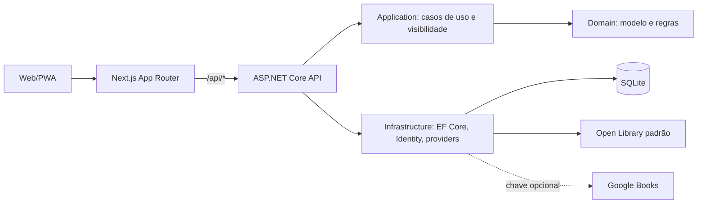
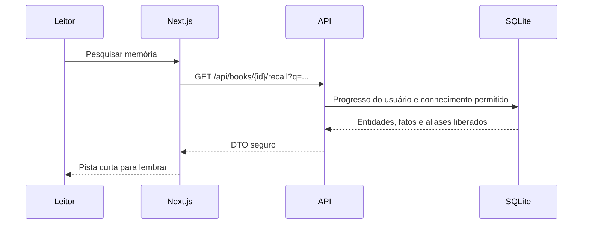

# Arquitetura do Mnemora

A aplicação é um monólito modular. A API autentica, valida entrada, autoriza e retorna DTOs. A Application coordena consultas, normalização de ISBN e a política de visibilidade. A Domain define entidades e invariantes. A Infrastructure persiste dados, implementa Identity e combina providers externos de metadados. A Open Library funciona sem chave; o Google Books participa quando `GOOGLE_BOOKS_API_KEY` está configurada. Uma falha parcial preserva os resultados do provider que respondeu. A composição elimina duplicatas por ISBN-13, ISBN-10 ou, sem ISBN válido, provider/ID.

A busca guarda somente resultados externos públicos no `IMemoryCache` por quatro horas. Esse cache é local ao processo e não contém sessão, biblioteca ou progresso. Não há cache distribuído nem cache de dados privados.

O catálogo distingue packs curados, livros importados e livros privados. Um resultado externo preserva a identidade devolvida pelo provider e, quando existem dados específicos de edição, usa essa edição em vez de misturá-la com os dados gerais da obra. O par provider/ID permite reutilizar a importação entre leitores; um cadastro manual pertence somente ao usuário que o criou. Antes da importação, o frontend apresenta uma confirmação somente leitura com os metadados que distinguem a edição. O registro compartilhado não recebe alterações particulares do leitor.

O modelo persiste título, subtítulo, autor, capa, ISBN-10/ISBN-13, editora, data de publicação e idioma. Página total, categorias e rótulo de edição existem apenas na busca e na confirmação. Descrições e sinopses eventualmente devolvidas pelos providers são descartadas antes do DTO e nunca são persistidas como catálogo ou lore. A presença de unidades de leitura define `memoryPackAvailable`: sem pack, o leitor ainda gerencia status, página e notas, mas as superfícies de lore não são oferecidas.

O navegador solicita `/api` na mesma origem do frontend. Cookies HttpOnly não são lidos por JavaScript. Mutação requer token antiforgery; a API restringe CORS e aplica `no-store` a conteúdo autenticado. O Next.js entrega a landing pública e o app responsivo; telas privadas fazem leitura pela API sem cache compartilhado.

