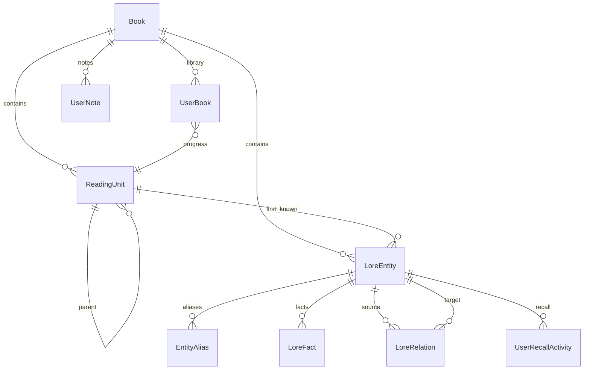

# Modelo de domínio do Mnemora

`Book` é o catálogo de metadados. `ReadingUnit` representa parte, capítulo ou seção canônica, com `OrderIndex` absoluto por livro, pai opcional e `SafeLabel` não revelador. A página em `UserBook` é referência pessoal; somente `CurrentReadingUnitId` controla o conhecimento.

`LoreEntity` representa personagem, facção, lugar, evento ou outro conceito. Seu nome, resumo inicial e imagem devem ser seguros em `FirstKnownAtUnitId`. `EntityAlias`, `LoreFact` e `LoreRelation` possuem `RevealAtUnitId` próprio. `MemoryHint` pertence a um fato, portanto segue a revelação dele. `ChronologyIndex` ordena eventos conhecidos independentemente da sequência de leitura.

`UserNote` e `UserRecallActivity` pertencem ao usuário e livro. A primeira é privada; a segunda guardará feedback simples de revisão e poderá alimentar funcionalidades futuras.

O banco mantém FKs, índices e unicidade de ordem/slug por livro. As operações de escrita também validam que pai, entidade, fato, relação e unidade de revelação pertencem ao mesmo livro, e que um fato ou relação não aparece antes das entidades envolvidas. As migrations são versionadas; SQLite é o provider inicial, sem regras de domínio dependentes dele.
