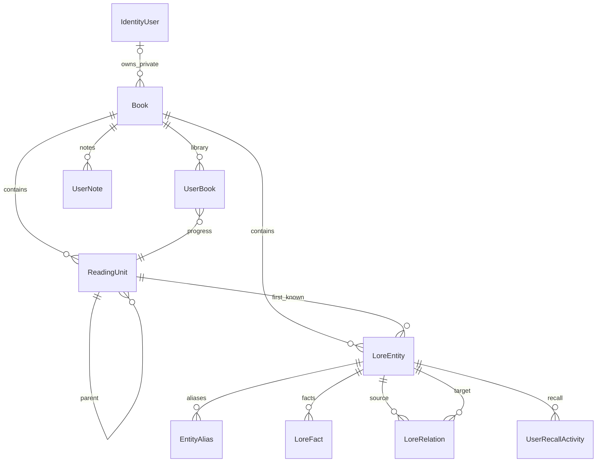

# Modelo de domínio do Mnemora

`Book` é o catálogo de metadados. `CatalogKind` separa três ciclos de vida: `Curated` para packs editoriais públicos, `Imported` para metadados externos reutilizáveis e `Private` para o cadastro manual de um leitor. Apenas livros privados possuem `OwnerUserId`; outro usuário não pode pesquisá-los, abrir seu detalhe nem adicioná-los à biblioteca. O par `ExternalProvider`/`ExternalId` identifica uma importação de forma global e idempotente. Descrições externas não são persistidas, porque podem conter spoilers.

`ReadingUnit` representa parte, capítulo ou seção canônica, com `OrderIndex` absoluto por livro, pai opcional e `SafeLabel` não revelador. A existência de ao menos uma unidade indica `MemoryPackAvailable`. Um livro sem pack ainda participa da biblioteca e aceita status, página de referência e notas gerais, mas não libera lore. A página em `UserBook` é referência pessoal; somente `CurrentReadingUnitId` controla o conhecimento quando há unidades.

`LoreEntity` representa personagem, facção, lugar, evento ou outro conceito. Seu nome, resumo inicial e imagem devem ser seguros em `FirstKnownAtUnitId`. `EntityAlias`, `LoreFact` e `LoreRelation` possuem `RevealAtUnitId` próprio. `MemoryHint` pertence a um fato, portanto segue a revelação dele. `ChronologyIndex` ordena eventos conhecidos independentemente da sequência de leitura.

`UserNote` e `UserRecallActivity` pertencem ao usuário e livro. A primeira é privada e pode existir como nota geral mesmo em livros sem pack; a segunda guarda feedback simples de revisão e pode alimentar funcionalidades futuras.

O banco mantém FKs, índices, unicidade de ordem/slug por livro e unicidade do identificador externo. ISBN-10 e ISBN-13 de cadastros privados são únicos por proprietário, e uma restrição garante que somente livros `Private` tenham dono. As operações de escrita também validam que pai, entidade, fato, relação e unidade de revelação pertencem ao mesmo livro, e que um fato ou relação não aparece antes das entidades envolvidas. As migrations são versionadas; SQLite é o provider inicial, sem regras de domínio dependentes dele.
