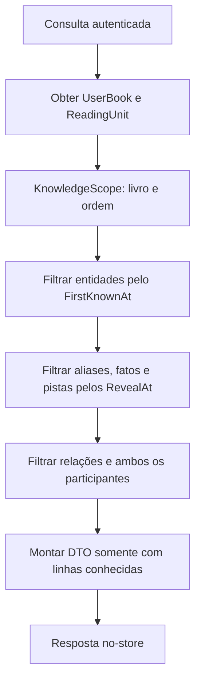

# Sistema antisspoiler do Mnemora

O conhecimento do usuário é definido pelo livro em sua biblioteca e pela ordem da unidade de leitura atual. `KnowledgeVisibility.CanSee` define a fronteira inclusiva: uma informação liberada na unidade 20 pode aparecer quando o progresso é 20; uma informação da unidade 21 não. Sem progresso, o conjunto conhecido está vazio.

`KnowledgeReader` em Infrastructure é o caminho de leitura pública do lore. Seus predicados são executados no SQL antes de materializar entidades e montar DTOs. A busca usa nome e resumo inicial das entidades conhecidas, aliases liberados e conteúdo/pistas de fatos liberados. Uma palavra presente só em texto futuro não pode produzir resultado, mesmo que a entidade principal já seja conhecida. Busca por ID de entidade futura e livro fora da biblioteca retorna 404, sem sugerir sua existência.

Uma relação só aparece após sua unidade de revelação **e** quando suas duas entidades são conhecidas. A timeline usa apenas eventos conhecidos. O resumo inicial, nome e imagem de `LoreEntity` precisam ser seguros no primeiro ponto de conhecimento; fatos posteriores devem ficar em `LoreFact`. Unidades futuras usam `SafeLabel` público, e seu título completo só aparece ao alcançar a unidade.

Atualizar o progresso recalcula o escopo em cada pedido. Retroceder revoga fatos; nenhuma resposta privada é cacheada. O painel Admin pode acessar o conteúdo completo, mas seu preview deve chamar a mesma projeção segura com uma unidade simulada.

Os testes cobrem fronteira antes/no/depois, estado sem progresso, avanço e retrocesso, alias e pistas futuras, fato/relação/entidade/evento futuros e endpoints REST. Mudanças no esquema de lore ou em qualquer consulta pública exigem repetir esses testes.
