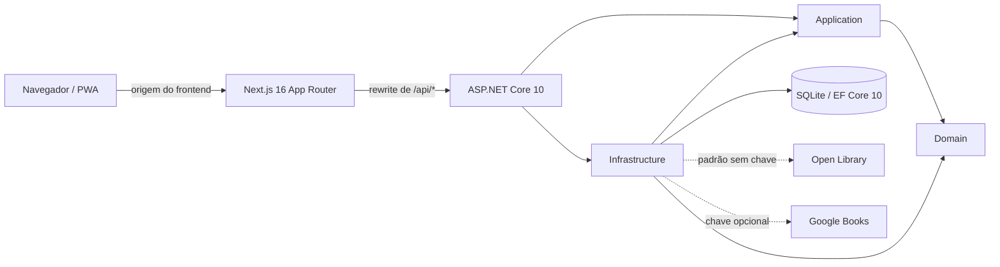
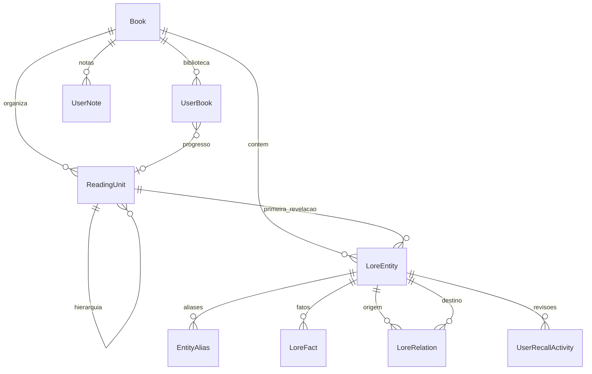
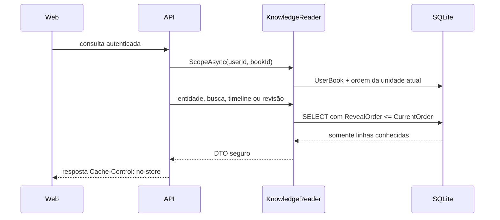

# Arquitetura técnica do Mnemora

## Objetivo e princípios

O Mnemora é um companion de leitura mobile-first que ajuda o leitor a recuperar personagens, lugares, facções, relações e eventos sem revelar conteúdo posterior ao seu progresso. O requisito estrutural é que informação futura não chegue ao navegador. Por isso, o backend determina o conjunto conhecido e filtra as linhas antes de montar qualquer DTO público.

Os princípios que orientam a implementação são:

- o progresso canônico é uma unidade de leitura ordenada; a página é apenas uma referência pessoal;
- a fronteira de revelação é inclusiva: algo revelado na ordem atual já pode aparecer;
- ausência de progresso produz um conjunto de lore vazio;
- retroceder o progresso revoga conteúdo que deixou de ser conhecido;
- busca, detalhe, timeline, revisão, notas vinculadas e preview usam a mesma regra de visibilidade;
- dados privados são obtidos sob demanda e não entram em cache compartilhado ou no cache da PWA;
- conteúdo administrativo e metadados externos só se tornam lore por uma decisão editorial explícita.

## Visão do sistema

O produto é um monólito modular com dois processos no desenvolvimento local. O Next.js atende `http://localhost:3000`; o ASP.NET Core atende `http://localhost:5100`. O rewrite de `/api/:path*` mantém as chamadas do navegador na origem do frontend, inclusive cookies e antiforgery. Em uma implantação, o mesmo contrato exige que o proxy preserve `/api` na mesma origem pública.

Não há cache distribuído, fila ou serviço de IA. O estado persistente fica no SQLite. A Open Library é o provider externo padrão e funciona sem chave; o Google Books é uma fonte adicional quando `GOOGLE_BOOKS_API_KEY` está configurada. Ambos fornecem somente metadados bibliográficos. Um `IMemoryCache` local guarda por quatro horas apenas respostas públicas de pesquisa dos providers; dados de usuário continuam fora de qualquer cache compartilhado ou da PWA.

## Organização do repositório e dependências

| Área | Responsabilidade | Dependências relevantes |
| --- | --- | --- |
| `apps/web` | Landing, autenticação, biblioteca, leitura, lore, recall, notas, revisão, administração e PWA | Next.js 16.3.5, React 19.3, TypeScript |
| `src/Mnemora.Domain` | Entidades, enums e estado persistente do domínio | Nenhuma outra camada do produto |
| `src/Mnemora.Application` | Regras compartilhadas de visibilidade, integridade e contratos de projeção | Domain |
| `src/Mnemora.Infrastructure` | EF Core, Identity, SQLite, consultas seguras, consistência, seed e providers Open Library/Google Books | Application e Domain |
| `src/Mnemora.Api` | Composição, autenticação, autorização, validação HTTP, endpoints e políticas transversais | Application e Infrastructure |
| `tests/Mnemora.Tests` | Testes de domínio, integração e endpoints com `WebApplicationFactory` | Todas as camadas do backend |
| `tests/pwa` | Contratos do manifesto, ícones e cache do service worker | Node test runner |

O `MnemoraDbContext` também é o store do ASP.NET Core Identity. As migrations ficam em `src/Mnemora.Infrastructure/Persistence/Migrations`; o banco local `mnemora.db` é ignorado pelo Git.

## Modelo de dados

- `Book` guarda título, subtítulo, autoria, capa, ISBN-10/ISBN-13, editora, data de publicação, idioma e identificadores externos. `CatalogKind` distingue `Curated`, `Imported` e `Private`; somente o tipo privado possui `OwnerUserId`. A combinação de provider e identificador externo é única, e ISBNs normalizados de livros privados são únicos por proprietário. Página total, categorias e rótulo de edição são dados transitórios da busca, sem novas colunas persistentes.
- `ReadingUnit` representa parte, capítulo, seção ou subseção. `OrderIndex` é absoluto e único dentro do livro; `ParentUnitId` cria a hierarquia. `SafeLabel` pode ser mostrado antes da unidade, enquanto `Title` só é exposto depois da fronteira.
- `UserBook` registra posse na biblioteca, status, unidade atual e página informativa. A combinação de usuário e livro é única.
- `LoreEntity` representa personagem, facção, lugar, criatura, item, evento, organização ou conceito. `FirstKnownAtUnitId` libera nome, descrição curta e imagem. Eventos podem usar `ChronologyIndex`, independente da ordem de leitura.
- `EntityAlias`, `LoreFact` e `LoreRelation` têm seu próprio `RevealAtUnitId`. Uma relação referencia origem e destino e só pode existir a partir do momento em que ambos são conhecidos.
- `UserNote` pertence a um usuário e livro e pode apontar para uma entidade ou unidade.
- `UserRecallActivity` registra o feedback simples “Eu lembro” ou “Preciso revisar”; o MVP não calcula agendamento espaçado.

Além das FKs e índices do banco, `BookIntegrity` valida vínculos entre livros e ordem de revelação. `BookConsistency` impede que uma edição ou reordenação administrativa coloque aliases e fatos antes da entidade, relações antes dos participantes ou filhos antes do pai.

## Motor antisspoiler

`KnowledgeReader` é o caminho de leitura pública do lore. Cada requisição autenticada começa com `ScopeAsync`, que confirma a presença do livro na biblioteca do usuário e converte `CurrentReadingUnitId` em `CurrentOrder`.

As fronteiras são aplicadas assim:

| Conteúdo | Condição de visibilidade |
| --- | --- |
| Entidade | A ordem de `FirstKnownAtUnitId` é menor ou igual à ordem atual |
| Alias | O alias já foi revelado e sua entidade é conhecida |
| Fato e pista de memória | O fato já foi revelado e sua entidade é conhecida |
| Relação | A relação já foi revelada e origem e destino são conhecidos |
| Evento na timeline | A entidade do tipo evento é conhecida; a lista usa `ChronologyIndex` |
| Título de unidade | O título real aparece apenas quando a unidade é conhecida; antes disso, usa-se `SafeLabel` |
| Nota vinculada | Usuário é o dono e a entidade/unidade vinculada continua conhecida |

`KnownEntities`, `KnownAliases`, `KnownFacts` e `KnownRelations` retornam `IQueryable` com joins e predicados de ordem. A materialização ocorre depois desses filtros. O detalhe de uma entidade futura e um livro fora da biblioteca retornam `404`, sem confirmar a existência do conteúdo.

O Recall primeiro materializa apenas as fontes conhecidas e então normaliza caixa e diacríticos em .NET. Isso contorna as limitações Unicode de `LOWER`/`NOCASE` do SQLite sem ampliar o conjunto candidato. Um termo que existe somente em alias, fato ou pista futura não produz resultado. A busca vazia retorna uma lista vazia e o resultado é limitado a 12 entidades.

O preview administrativo constrói um `KnowledgeScope` para a unidade escolhida e chama o mesmo `KnowledgeReader`. Assim, o painel não mantém uma segunda interpretação da fronteira. Alterar ou retroceder o progresso também não depende de invalidação: a ordem é obtida novamente em cada requisição.

## Segurança e privacidade

A autenticação usa ASP.NET Core Identity com cookie `Mnemora.Auth`. O cookie é `HttpOnly`, `SameSite=Lax` e se torna `Secure` em produção. E-mails são únicos; a senha exige pelo menos 10 caracteres, uma letra maiúscula, uma minúscula e um dígito; cinco falhas de login bloqueiam a conta por 15 minutos. Cadastro e login possuem rate limit por IP. Recall, integrações externas e escritas de notas/revisão também têm limites próprios.

Todas as mutações `POST`, `PUT`, `PATCH` e `DELETE` sob `/api` passam pela validação antiforgery. O cliente solicita `GET /api/auth/csrf` e envia o token no header `X-CSRF-TOKEN`; o cookie antiforgery também é `HttpOnly`, `SameSite=Lax` e `Secure` em produção. A API responde `401` e `403` diretamente, sem redirects HTML, e usa Problem Details para erros.

Os endpoints de biblioteca, lore, notas e revisão exigem autenticação. Consultas partem do identificador da sessão e filtram propriedade; IDs pertencentes a outro usuário são tratados como não encontrados. `/api/admin` requer a role `Admin`. Credenciais administrativas não ficam no repositório: o seed lê `ADMIN_EMAIL` e `ADMIN_PASSWORD` do ambiente. Se o e-mail já existir, a promoção só ocorre quando a senha configurada corresponde à conta; resultados de criação da role e atribuição também são verificados.

Um middleware aplica `Cache-Control: no-store` a toda resposta sob `/api`. O cliente também usa `fetch` com `cache: "no-store"` e `credentials: "same-origin"`. CORS permite apenas a origem configurada em `Mnemora:WebOrigin`. Os providers externos têm timeout; a composição consulta as fontes configuradas, combina resultados, tolera falha parcial e elimina duplicatas na ordem ISBN-13, ISBN-10 e provider/ID. ISBNs formatados são validados e convertidos para a forma canônica antes de uma consulta exata.

Resultados externos bem-sucedidos ficam no `IMemoryCache` por quatro horas, indexados somente pela consulta normalizada. A API continua executando a pesquisa local e a autorização do usuário em cada requisição; sessão, catálogo privado, biblioteca e progresso não entram nesse cache. A importação persiste somente título, subtítulo, autor, capa, ISBN-10/ISBN-13, editora, data de publicação e idioma. Página total, categorias e rótulo de edição são exibidos na seleção, mas não gravados. Descrições e sinopses eventualmente devolvidas pelos providers não entram no contrato de metadados, no DTO ou no banco, pois podem conter spoilers. `OPEN_LIBRARY_CONTACT` pode definir o contato do `User-Agent` enviado à Open Library; sem a variável, usa-se a URL pública do repositório. Cada usuário pode manter até 200 notas por livro, e a revisão conserva as 500 atividades mais recentes por usuário e livro. Essas escritas são serializadas no processo, de acordo com a implantação SQLite de instância única prevista para o MVP.

O catálogo público (`GET /api/books`) contém apenas livros curados. A busca local inclui livros curados, importados compartilháveis e os cadastros privados do usuário atual. O detalhe e a inclusão na biblioteca tratam o livro privado de outro usuário como inexistente. Livros importados são reutilizados pelo par provider/ID; livros manuais são deduplicados somente dentro da conta proprietária. O frontend não permite alterações individuais nos metadados compartilhados: ele mostra uma confirmação somente leitura e envia o provider/ID escolhido apenas depois da ação explícita do leitor.

O Next.js envia Content Security Policy, `X-Content-Type-Options`, `X-Frame-Options`, política de referrer, Permissions Policy e HSTS. Em produção, o proxy deve terminar TLS, preservar a mesma origem pública e ser cadastrado explicitamente em `Mnemora:KnownProxies`; a API só então usa `X-Forwarded-For` e `X-Forwarded-Proto` para esquema, cookies e partições de rate limit.

## Fluxos funcionais

### Leitor

1. O usuário se cadastra ou entra e recebe a sessão HttpOnly.
2. A busca consulta o catálogo local e a Open Library; se houver `GOOGLE_BOOKS_API_KEY`, também consulta o Google Books. Um ISBN válido favorece a consulta exata, e resultados de fontes diferentes são deduplicados sem comparar apenas título e autor.
3. O leitor abre a confirmação de um resultado externo, confere os dados da edição e confirma a inclusão. Só então o frontend chama `POST /api/library/external` com `{ "externalProvider": "...", "externalId": "..." }`; a operação reutiliza o livro importado quando ele já existe.
4. Se o livro não for encontrado, `POST /api/library/manual` aceita título obrigatório, autor opcional e ISBN opcional e cria um registro privado para o leitor.
5. O leitor escolhe a unidade alcançada quando existe um pack; a página, quando informada, não muda o conhecimento.
6. Livros com pack oferecem personagens, facções, lugares, timeline, detalhe e Recall projetados para a ordem atual.
7. Livros sem pack ainda oferecem status, página de referência e notas privadas, sem inferir ou gerar lore.
8. Notas gerais ficam disponíveis ao dono; notas vinculadas acompanham a visibilidade da referência.
9. A revisão seleciona deterministicamente até cinco entidades conhecidas e registra o feedback.

### Administração

1. Um Admin criado por seed gerencia livros e unidades.
2. O editor mantém entidades, aliases, fatos e relações e associa cada item a uma unidade de revelação.
3. As operações recusam referências entre livros e sequências inconsistentes.
4. A reordenação verifica todas as revelações afetadas antes de persistir.
5. O preview simula o ponto escolhido com a projeção segura usada pelo leitor.

O seed `O Arquivo da Neblina` contém conteúdo curto e original. Ele é idempotente por `ExternalProvider` e `ExternalId`; executar `--seed` novamente não duplica o pack.

## PWA, temas e cache

O App Router fornece metadata, manifesto em português, ícones próprios de 192 e 512 pixels, ícone maskable e tema light/dark/system. O service worker só é registrado em build de produção.

O cache `mnemora-shell-v1` possui uma allowlist estreita:

- pré-cache da landing pública e dos ícones locais;
- navegação para `/` em modo network-first, com a cópia pública como fallback;
- assets em `/_next/static/`, `/icons/` e `/favicon.ico` em modo cache-first;
- nenhuma interceptação de requisições RSC ou conteúdo fora desse shell.

Os prefixos `/api`, `/app` e `/admin` saem imediatamente do handler sem consulta, abertura ou gravação em Cache Storage. Login, recuperação e outros documentos também seguem direto para a rede. Respostas com `no-store` ou `private` não podem ser armazenadas, e o próprio `sw.js` é entregue com `no-cache, no-store, must-revalidate`.

## Operação, decisões e riscos

- O SQLite simplifica a instalação local e o MVP. Escrita concorrente intensa e múltiplas réplicas exigiriam a migração para um banco servidor.
- Uma implantação com múltiplos processos também deve substituir a serialização local das quotas por uma garantia transacional no banco ou um coordenador distribuído.
- Em desenvolvimento, a API aplica migrations ao iniciar. Em outros ambientes, a atualização deve ser executada explicitamente antes da aplicação, ou por um processo de release controlado.
- Cada proxy reverso confiável deve ter seu IP configurado em `Mnemora:KnownProxies`; headers encaminhados de proxies desconhecidos não devem participar das decisões de segurança.
- Livros importados e manuais não recebem unidades ou lore automaticamente. Sem um memory pack, a interface mantém status, página e notas e oculta a navegação de personagens, lugares, timeline, Recall e revisão.
- O cache de pesquisas externas é local a cada processo e pode ser descartado em reinícios. Ele reduz chamadas repetidas, mas não coordena múltiplas instâncias.
- A segurança antisspoiler depende da curadoria de `ShortDescription` e `ImageUrl` para o primeiro ponto de conhecimento e da marcação correta de cada revelação. As validações impedem inconsistência temporal estrutural, mas não avaliam semanticamente o texto escrito por um Admin.
- A PWA oferece o shell público offline. A área autenticada exige rede de propósito, para que progresso retrocedido e dados privados nunca sejam servidos de um cache local antigo.
- Recuperação de senha, busca semântica, geração por IA e repetição espaçada são extensões futuras e não fazem parte deste MVP.
